<!-- README.md is generated from README.Rmd. Please edit that file -->

# cfdecomp v0.1.0

<!-- badges: start -->

[](https://travis-ci.com/MaartenBijlsma/cfdecomp)
<!-- badges: end -->

cfdecomp stands for ‘counterfactual decomposition’. This package
provides functions to decompose differences in an outcome attributable
to a mediating variable (or sets of mediating variables) between groups
based on counterfactual (causal inference) theory. By using Monte Carlo
(MC) integration (simulations based on empirical estimates from
multivariable models) we provide added flexibility compared to existing
(analytical) approaches, at the cost of computational power or time. The
added flexibility means that we can decompose difference between groups
in any outcome or and with any mediator (any variable type and
distribution). See [Sudharsanan & Bijlsma
(2019)](https://dx.doi.org/10.4054/MPIDR-WP-2019-004) for more
information.

## Installation

You can install the released version of cfdecomp from
[CRAN](https://CRAN.R-project.org) with:

``` r
install.packages("cfdecomp")
```

## Example

``` r
library(cfdecomp)

formula.y.example <- 'out.gauss ~ med.gauss + age + med.binom'
formula.m.example <- 'med.gauss ~ age'

# run the procedure for a gaussian outcome and gaussian mediator
mean.results.1 <- cfd.mean(formula.y='out.gauss ~ SES + med.gauss + med.binom + age',
              formula.m='med.gauss ~ SES + age',
              mediator='med.gauss',
              group='SES',
              data=cfd.example.data,
              family.y='gaussian',
              family.m='gaussian',
              bs.size=250,
              mc.size=50,
              alpha=0.05)

# see if our modelling procedure approximates the mean of the mediator well
# for SES group 1
hist(mean.results.1$out_nc_m[,1],col='grey',xlab='MC iteration means of M of SES group 1',
     main='Comparison of MC approximation to empirical mean of mediator M')
# place empirical mean of M in the histogram:
abline(v=mean(cfd.example.data$med.gauss[cfd.example.data$SES==1]),lwd=4)
```

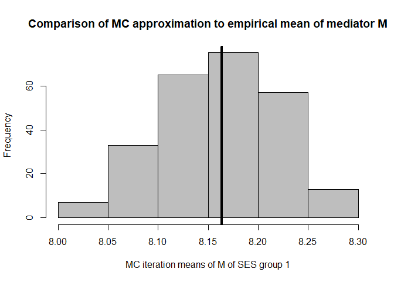

``` r
# approximation of the mean of M over the Monte Carlo iterations for SES group 1:
mean(mean.results.1$out_nc_m[,1])
#> [1] 8.166413
# empirical mean of mediator M for SES group 1:
mean(cfd.example.data$med.gauss[cfd.example.data$SES==1])
#> [1] 8.163461
# conclusion: on average, our distributions of means of M centers on the empirical distribution of M

# for SES group 2
hist(mean.results.1$out_nc_m[,2],col='grey',xlab='MC iteration means of M of SES group 2',
     main='Comparison of MC approximation to empirical mean of mediator M')
# place empirical mean of M in the histogram:
abline(v=mean(cfd.example.data$med.gauss[cfd.example.data$SES==2]),lwd=4)
```

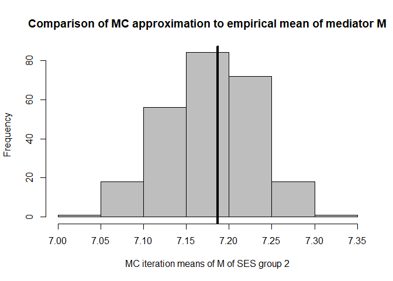

``` r
mean(mean.results.1$out_nc_m[,2]);mean(cfd.example.data$med.gauss[cfd.example.data$SES==2])
#> [1] 7.181744
#> [1] 7.186521
# conclusion: also for group 2, approximation is good

# for SES group 3
hist(mean.results.1$out_nc_m[,3],col='grey',xlab='MC iteration means of M of SES group 3',
     main='Comparison of MC approximation to empirical mean of mediator M')
# place empirical mean of M in the histogram:
abline(v=mean(cfd.example.data$med.gauss[cfd.example.data$SES==3]),lwd=4)
```

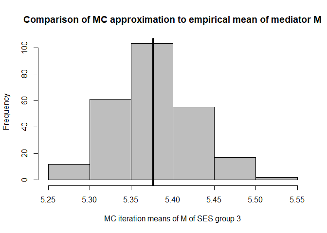

``` r
mean(mean.results.1$out_nc_m[,3]);mean(cfd.example.data$med.gauss[cfd.example.data$SES==3])
#> [1] 5.377593
#> [1] 5.376548
# conclusion: also for group 3, approximation of M is good

# see if our modelling procedure approximates the mean of outcome Y well
# for SES group 1
hist(mean.results.1$out_nc_y[,1],col='grey',xlab='MC iteration means of Y of SES group 1',
     main='Comparison of MC approximation to empirical mean of outcome Y')
# place empirical mean of outcome Y in the histogram:
abline(v=mean(cfd.example.data$out.gauss[cfd.example.data$SES==1]),lwd=4)
```

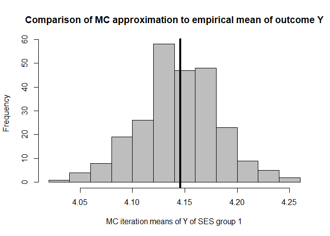

``` r
mean(mean.results.1$out_nc_y[,1]);mean(cfd.example.data$out.gauss[cfd.example.data$SES==1])
#> [1] 4.147698
#> [1] 4.145881
# conclusion: on average, our distributions of means of Y centers on the empirical distribution of Y 

# for SES group 2
hist(mean.results.1$out_nc_y[,2],col='grey',xlab='MC iteration means of Y of SES group 2',
     main='Comparison of MC approximation to empirical mean of outcome Y')
# place empirical mean of outcome Y in the histogram:
abline(v=mean(cfd.example.data$out.gauss[cfd.example.data$SES==2]),lwd=4)
```

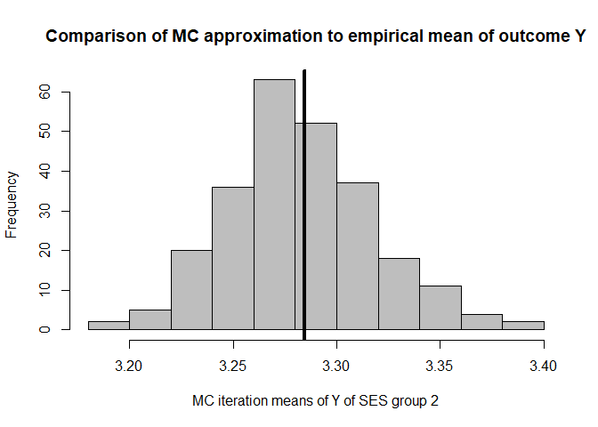

``` r
mean(mean.results.1$out_nc_y[,2]);mean(cfd.example.data$out.gauss[cfd.example.data$SES==2])
#> [1] 3.28048
#> [1] 3.284409
# conclusion: also for group 2, approximation of Y is good

# for SES group 3
hist(mean.results.1$out_nc_y[,3],col='grey',xlab='MC iteration means of Y of SES group 3',
     main='Comparison of MC approximation to empirical mean of outcome Y')
# place empirical mean of outcome Y in the histogram:
abline(v=mean(cfd.example.data$out.gauss[cfd.example.data$SES==3]),lwd=4)
```

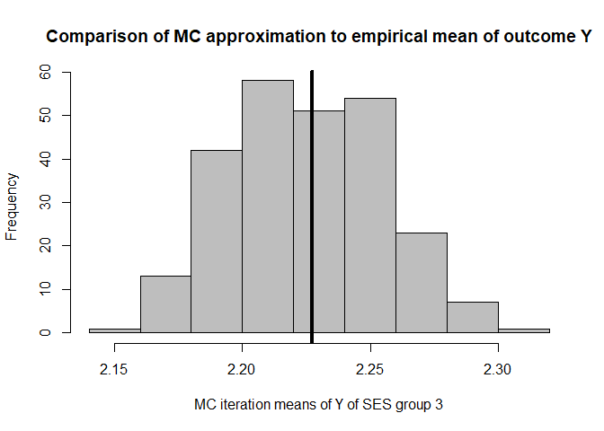

``` r
mean(mean.results.1$out_nc_y[,3]);mean(cfd.example.data$out.gauss[cfd.example.data$SES==3])
#> [1] 2.226078
#> [1] 2.227222
# conclusion: also for group 3, approximation of Y is good

# looks good!

# estimate the effect of the intervention and proportion mediated (decomposition)
# the differences between SES groups 1 and 2 were first:
mean(mean.results.1$out_nc_y[,2] - mean.results.1$out_nc_y[,1])
#> [1] -0.8672176
# and after giving the gaussian mediator of SES group 2 the distribution of the one in group 1
# the difference becomes:
mean(mean.results.1$out_cf_y[,2] - mean.results.1$out_nc_y[,1])
#> [1] -0.6582674
# so the proportion of the outcome Y that is due to differences between the two SES groups in the gaussian mediator is
mean(1-(mean.results.1$out_cf_y[,2] - mean.results.1$out_nc_y[,1]) / (mean.results.1$out_nc_y[,2] - mean.results.1$out_nc_y[,1]))
#> [1] 0.2412226
# we can also get this number, and the one from the comparison of the other SES group with group 1, straight from the object
mean.results.1$mediation
#>         2         3 
#> 0.2412226 0.3067384
# you'll notice the first number is the same as the one we calculated ourselves from the output
# this is the proportion mediated when coming the first and the second SES group
# the second number is the proportion mediated when comparing the first and the third SES group
# and we can get the 1-alpha confidence intervals for each:
mean.results.1$mediation_quantile
#>               2         3
#> 2.5%  0.2101112 0.2812851
#> 97.5% 0.2788443 0.3319271

# if a mediator is binomial distributed
mean.results.2 <- cfd.mean(formula.y='out.gauss ~ med.pois + age + med.binom',
              formula.m='med.binom ~ age',
              mediator='med.binom',
              group='SES',
              data=cfd.example.data,
              family.y='gaussian',
              family.m='binomial',
              bs.size=250,
              mc.size=50,
              alpha=0.05)

# if a mediator is Poisson distributed
mean.results.3 <- cfd.mean(formula.y='out.gauss ~ med.pois + age + med.binom',
              formula.m='med.pois ~ age',
              mediator='med.pois',
              group='SES',
              data=cfd.example.data,
              family.y='gaussian',
              family.m='poisson',
              bs.size=250,
              mc.size=50,
              alpha=0.05)

# we have chosen 50 Monte Carlo iterations and 250 bootstrap iterations
# are these number enough for stability? (also consider the scale of the Y-axis)

# bootstrap, mediator, by SES group
plot(conv.mean(mean.results.1$out_nc_m[,1]),type='l',ylab='Cumulative average of M',
     main='Bootstrap stability in SES group 1',xlab='Bootstrap iteration')
```

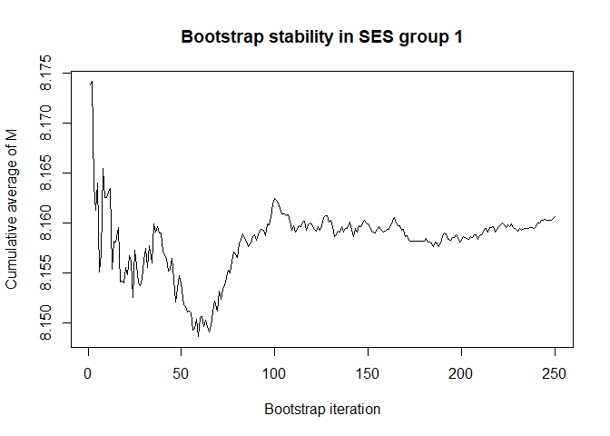

``` r
plot(conv.mean(mean.results.1$out_nc_m[,2]),type='l',ylab='Cumulative average of M',
     main='Bootstrap stability in SES group 2',xlab='Bootstrap iteration')
```

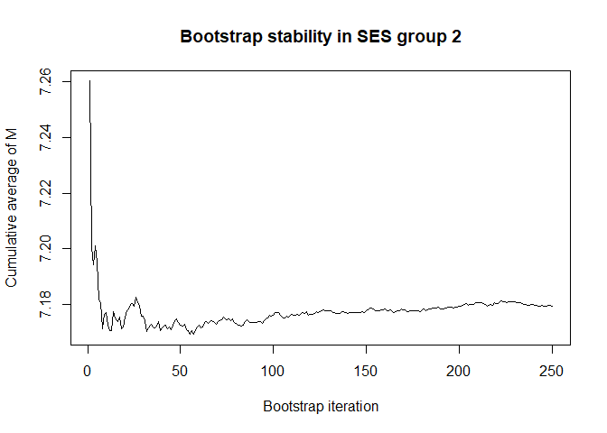

``` r
plot(conv.mean(mean.results.1$out_nc_m[,3]),type='l',ylab='Cumulative average of M',
     main='Bootstrap stability in SES group 3',xlab='Bootstrap iteration')
```

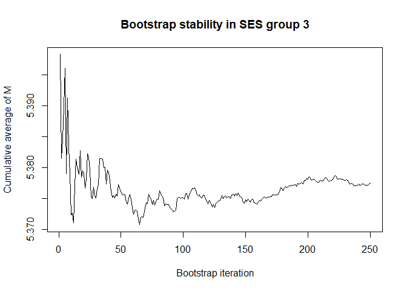

``` r

# bootstrap, outcome, by SES group
plot(conv.mean(mean.results.1$out_nc_y[,1]),type='l',ylab='Cumulative average of Y',
     main='Bootstrap stability in SES group 1',xlab='Bootstrap iteration')
```

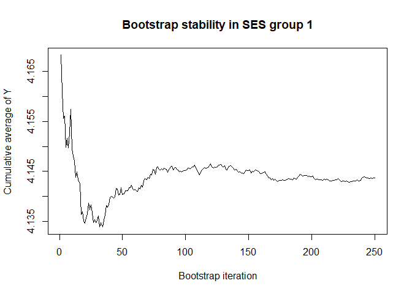

``` r
plot(conv.mean(mean.results.1$out_nc_y[,2]),type='l',ylab='Cumulative average of Y',
     main='Bootstrap stability in SES group 2',xlab='Bootstrap iteration')
```

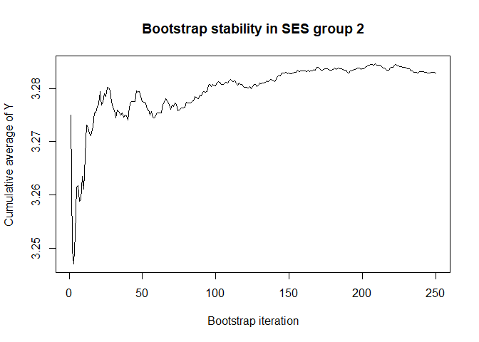

``` r
plot(conv.mean(mean.results.1$out_nc_y[,3]),type='l',ylab='Cumulative average of Y',
     main='Bootstrap stability in SES group 3',xlab='Bootstrap iteration')
```

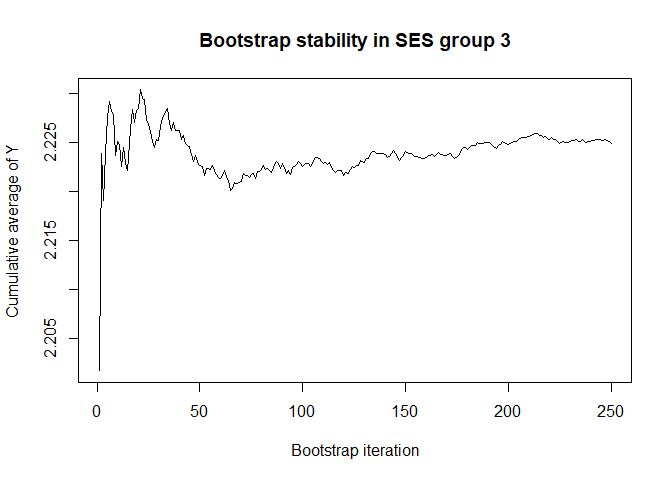

``` r
# a bootstrap size of 250 is more than enough for stability of the estimate
# of course, we want a large size to also get precise quantiles (confidence intervals)

# for mc iterations, let's first get some insight by going a higher mc.size number and only 1 bootstrap iteration
x <- cfd.mean(formula.y='out.gauss ~ med.pois + age + med.binom',
              formula.m='med.pois ~ age',
              mediator='med.pois',
              group='SES',
              data=cfd.example.data,
              family.y='gaussian',
              family.m='poisson',
              bs.size=1,
              mc.size=250,
              alpha=0.05)

# Monte Carlo, mediator, by SES group
plot(x$mc_conv_info_m[,1],type='l',ylab='Cumulative average of M',
     main='Monte Carlo stability in SES group 1',xlab='Monte Carlo iteration')
```


``` r
plot(x$mc_conv_info_m[,2],type='l',ylab='Cumulative average of M',
     main='Monte Carlo stability in SES group 2',xlab='Monte Carlo iteration')
```

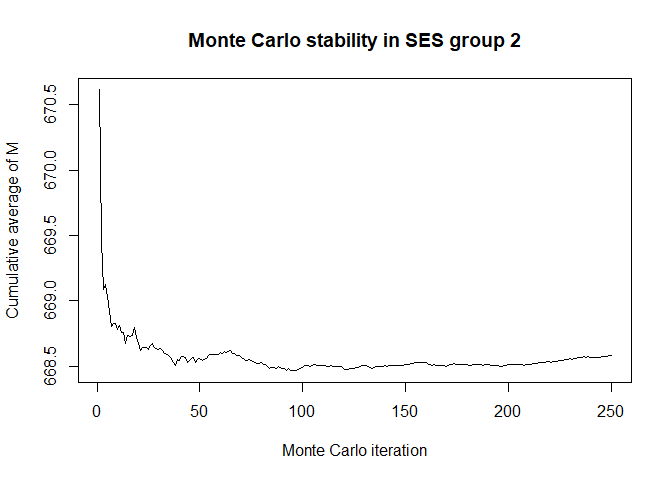

``` r
plot(x$mc_conv_info_m[,3],type='l',ylab='Cumulative average of M',
     main='Monte Carlo stability in SES group 3',xlab='Monte Carlo iteration')
```


``` r

# Bootstrap, mediator, by SES group
plot(x$mc_conv_info_y[,1],type='l',ylab='Cumulative average of Y',
     main='Monte Carlo stability in SES group 1',xlab='Monte Carlo iteration')
```

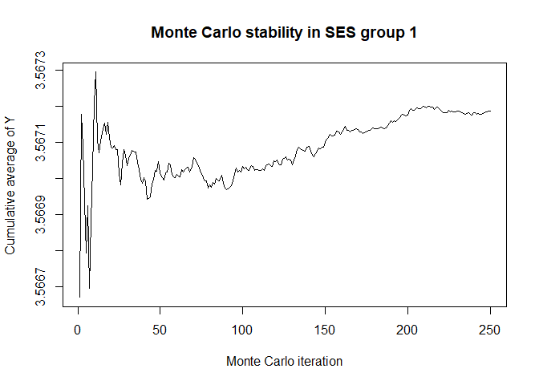

``` r
plot(x$mc_conv_info_y[,2],type='l',ylab='Cumulative average of Y',
     main='Monte Carlo stability in SES group 2',xlab='Monte Carlo iteration')
```

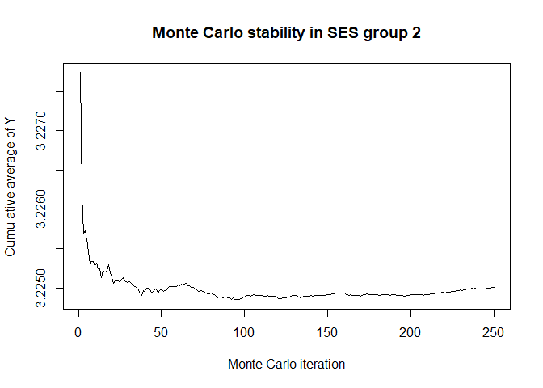

``` r
plot(x$mc_conv_info_y[,3],type='l',ylab='Cumulative average of Y',
     main='Monte Carlo stability in SES group 3',xlab='Monte Carlo iteration')
```

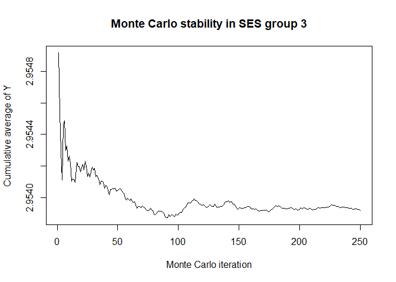

``` r

# 50 Monte Carlo iterations seems very sufficient


# modelling some quantile of outcome Y (probs=0.50 = median)
quantile.results.1 <- cfd.quantile(formula.y='out.gauss ~ SES + med.gauss + med.binom + age',
                           formula.m='med.gauss ~ SES + age',
                           mediator='med.gauss',
                           group='SES',
                           data=cfd.example.data,
                           family.y='gaussian',
                           family.m='gaussian',
                           bs.size=250,
                           mc.size=50,
                           alpha=0.05,
                           probs=0.50)

# the distribution of the residuals of the mediator or outcome is very non-normal
# (in the example they are normal) we can also choose to sample from the residuals
# of their models rather than assume normality
quantile.results.2 <- cfd.quantile(formula.y='out.gauss ~ SES + med.gauss + med.binom + age',
                                   formula.m='med.gauss ~ SES + age',
                                   mediator='med.gauss',
                                   group='SES',
                                   data=cfd.example.data,
                                   family.y='gaussian',
                                   family.m='gaussian',
                                   bs.size=250,
                                   mc.size=50,
                                   alpha=0.05,
                                   probs=0.50,
                                   sample.resid.y=TRUE,
                                   sample.resid.m=TRUE)


# semi-parametric estimation ...
mean.semipar.results.1 <- cfd.semipar.mean(formula='out.gauss ~ SES + med.gauss + med.binom + age',
                           mediator='med.gauss',
                           group='SES',
                           strata='age',
                           nbin=5,
                           data=cfd.example.data,
                           family='gaussian',
                           bs.size=250,
                           mc.size=50,
                           alpha=0.05)

quantile.semipar.results.1 <- cfd.semipar.quantile(formula='out.gauss ~ SES + med.gauss + med.binom + age',
                                           mediator='med.gauss',
                                           group='SES',
                                           strata='age',
                                           nbin=5,
                                           data=cfd.example.data,
                                           family='gaussian',
                                           bs.size=250,
                                           mc.size=50,
                                           alpha=0.05,
                                           probs=0.50)
```
